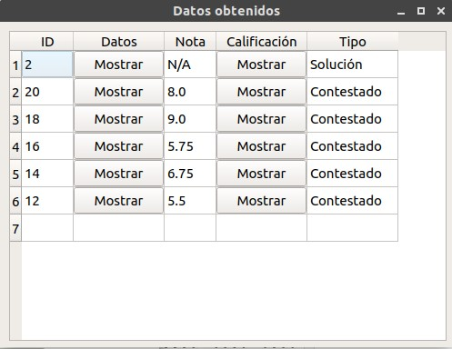

# BURBUJA APP

This is an app to grade and create tests with a unique format.

The format of the test correspond to a standardized test. 

The app needs a picture of the answered sheet to compare it with each solved test. The pictures must be photos of the test sheet and should comply with certain requirements.  

